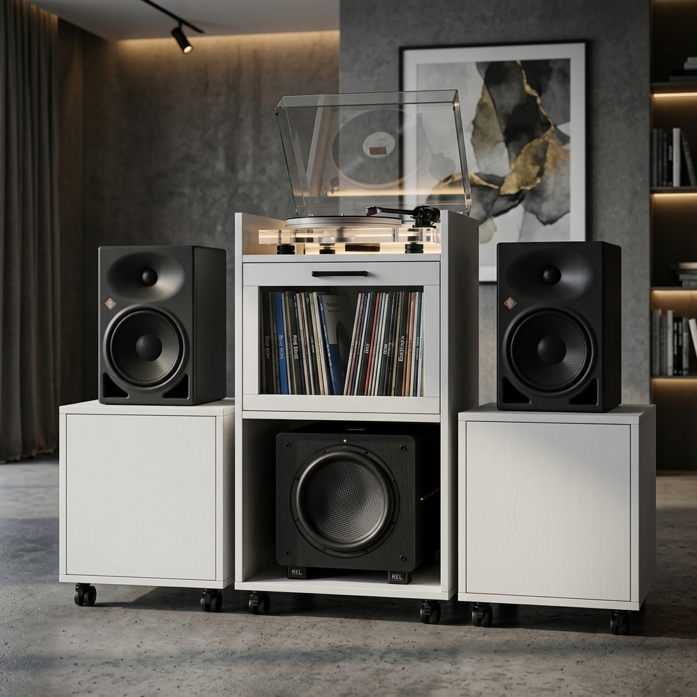

# 🎵 Radiola Rack

Bem-vindo ao repositório do **Radiola Rack**, um projeto open-source de marcenaria inteligente e design paramétrico criado para audiófilos e colecionadores de discos de vinil.

## 💡 Motivação do Projeto

A ideia principal foi projetar um móvel sob medida que aliasse estética moderna, acústica perfeita e ergonomia para o uso diário. O design escolhido segue uma silhueta em degraus (estilo "Step-Ladder"), dividindo os pesados equipamentos de som em módulos para evitar que as vibrações mecânicas prejudiquem a reprodução dos discos.

O grande destaque ergonômico vai para a **Gaveta de Vinis estilo Loja de Discos**: uma gaveta profunda (40cm) com frentes de vidro e laterais de apenas 20cm, permitindo folhear os LPs de frente para trás, vendo suas capas originais, sem precisar curvar as costas.

## 🎛️ Equipamentos de Som Alocados

O móvel foi milimetricamente desenhado ("taylor-made") para acomodar o seguinte setup:

*   **Toca-discos (Radiola):** Audio-Technica AT-LP70X-BG.
    *   *Posição:* Na redoma superior do módulo central, protegida por uma tampa basculante de vidro.
*   **Monitores de Áudio (Caixas):** Par de Edifier R2750DB.
    *   *Posição:* No topo dos pedestais laterais (Y = 25cm do chão).
*   **Subwoofer:** Edifier T5 V2.
    *   *Posição:* No chão central, abrigado dentro de um "carrinho" próprio com rodízios, estacionado na "garagem" do módulo central.

## 🏗️ Arquitetura e Engenharia

Para garantir o total **isolamento acústico** — evitando que a intensa vibração dos graves do Subwoofer faça a agulha da vitrola pular no disco —, o móvel não é uma peça única. Ele é composto por **4 Módulos Independentes**, todos equipados com rodízios de silicone:

1.  **Módulo Central (A Torre):** Abriga a vitrola (topo) e a gaveta de discos (meio). Deixa a parte inferior vazia (Garagem).
2.  **Pedestal Lateral Esquerdo:** Base para a caixa acústica esquerda, possui uma gaveta/bandeja para utensílios de manutenção de vinil.
3.  **Pedestal Lateral Direito:** Base para a caixa acústica direita, idêntico ao esquerdo.
4.  **Base Móvel (Carrinho) do Subwoofer:** Um carrinho rente ao chão que abriga o Edifier T5. Ele entra e sai da "garagem" do módulo central, mas não encosta nas paredes de madeira, garantindo que a trepidação vá para o chão e não para a torre.

### Soluções de Marcenaria
> [!TIP]
> **Engenharia do Vidro:** Para evitar que o puxador force o vidro temperado (criando efeito alavanca ao abrir gavetas pesadas cheias de discos), utilizamos a técnica de puxadores cilíndricos nos parafusos de fixação superiores. O usuário puxa a gaveta diretamente pelo ponto de tensão estrutural, evitando trincas no vidro.

## 🪵 Materiais Utilizados

*   **Madeira Estrutural:** MDF 18mm padrão "Branco Fosco TX" (Arauco ou Duratex).
*   **Fundos:** MDF 6mm branco.
*   **Acrílico/Vidro:** Vidros Temperados de 6mm e 8mm (Translúcidos/Cianos no projeto 3D para visualização).
*   **Ferragens:** Corrediças telescópicas pesadas (40cm).
*   **Mobilidade:** 16x Rodízios de Silicone Gel (5cm de altura) com e sem travas.

## 💻 Estrutura do Repositório (Tecnologias)

Este repositório serve como um "Diário de Obras" e portfólio, contendo as seguintes ferramentas de código:

*   **`index.html`**: O painel de controle interativo do projeto, com plantas baixas paramétricas escritas diretamente em SVGs escaláveis (Visão Dark Mode Blueprint).
*   **`visualizador_3d.html`**: Uma maquete 3D interativa programada do zero utilizando a biblioteca Javascript **Three.js** e *OrbitControls*. Permite girar, dar zoom e entender a montagem das peças no espaço.
*   **`importacao_maxcut_radiola.csv`**: Arquivo bruto em formato CSV com as peças, larguras, comprimentos e bordas de fita, formatado para importação direta no software de plano de corte **MaxCut**.
*   **`/assets/`**: Imagens conceituais e renders fotorrealistas.
*   **`/docs/`**: Documentação estendida do Plano de Implementação e Lista de Materiais com orçamento aproximado (em formato Markdown).

---
*Construído com design paramétrico e muito código HTML/JS. Preparado para a marcenaria do mundo real.*
